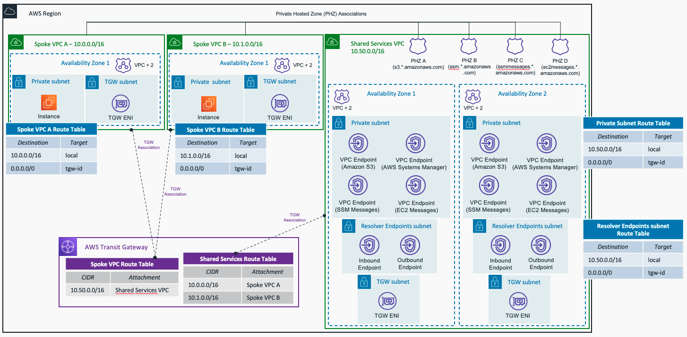

# AWS Hub and Spoke Architecture with Shared Services VPC - Terraform Sample

This repository contains terraform code to deploy a sample AWS Hub and Spoke architecture with Shared Services VPC, with the following centralized services:

- Managing EC2 instances using AWS Sytems Manager - ssm, ssmmessages and ec2messages VPC Endpoints.
- Amazon S3 access (the IAM role created for the EC2 instances allows READ ONLY access). If you want to change it, check the code in the *compute* module
- Hybrid DNS, both inbound and outbound Route 53 Resolver Endpoints are created.

The resources deployed and the architectural pattern they follow is purely for demonstration/testing purposes.

## Prerequisites

- An AWS account with an IAM user with the appropriate permissions
- Terraform installed

## Code Principles:

- Writing DRY (Do No Repeat Yourself) code using a modular design pattern

## Usage

- Clone the repository
- Edit the *variables.tf* file in the project root directory. This file contains the variables that are used to configure the VPCs to create, and Hybrid DNS configuration needed to work with your environment.
- To change the configuration about the Security Groups and VPC endpoints to create, edit the *locals.tf* file in the project root directory
- Initialize Terraform using `terraform init`
- Deploy the template using `terraform apply`

**Note** The default number of Availability Zones to use in the Spoke VPCs is 1. For the Shared Services VPC, the default (and minimum) number of AZs to use is 2 - due to configuration requirements for Route 53 Resolver Endpoints. To follow best practices, each resource - EC2 instance, VPC endpoints, and Route 53 Resolver Endpoints - will be created in each Availability Zone. **Keep this in mind** to avoid extra costs unless you are happy to deploy more resources and accept additional costs.

## Deployment

### Centralizing VPC Endpoints

- To centralize the SSM access for the instances created in the Spoke VPCs, 3 VPC endpoints are created with "Private DNS" option disabled: ssm, ssmmessages, and ec2messages. 3 Private Hosted Zones are created and associated with all the VPCs created (Spoke VPCs and Shared Services VPC) to allow DNS resolution.
- The fourth VPC endpoint created is to access Amazon S3. As indicated before, the EC2 instance roles only have *read* permission. 
- For the S3 connectivity, two resource records are created within the S3 PHZ: one for the apex of the domain, and the second as a wildcard to allow all records within this domain to be resolved to the VPC endpoint. One example you can use to test the access to S3 is the following one: `aws s3 --region {aws_region} ls s3://`

### Hybrid DNS

Both Amazon Route 53 Inbound and Outbound Resolver Endpoints are created. The configuration applied in the *variables.tf* file is not valid (example values). To use the example with your real-environment, please change the following variables:

- **on_premises_cidr**: Indicate the CIDR block of your on-premises location to allow DNS traffic in the Inbound Endpoints. This value is added in the Security Group attached to that endpoint.
- **forwarding_rules**: Add correct values of the DNS domains and DNS servers (target IPs) in your on-premises location. This values are used by the Outbound Endpoints to forward DNS queries from AWS to your on-premises DNS servers.

## Target Architecture

### References

- AWS Reference Architecture - [Hybrid DNS Resolution with Amazon Route 53 Resolver Endpoints](https://d1.awsstatic.com/architecture-diagrams/ArchitectureDiagrams/hybrid-dns_route53-resolver-endpoint-ra.pdf)
- AWS Whitepaper - [Building a Scalable and Secure Multi-VPC AWS Network Infrastructure](https://docs.aws.amazon.com/whitepapers/latest/building-scalable-secure-multi-vpc-network-infrastructure/welcome.html)
- AWS Documentation - [AWS PrivateLink for Amazon S3 interface endpoints](https://docs.aws.amazon.com/AmazonS3/latest/userguide/privatelink-interface-endpoints.html#accessing-s3-interface-endpoints)
- AWS Blogs - [Secure hybrid access to Amazon S3 using AWS PrivateLink](https://aws.amazon.com/blogs/networking-and-content-delivery/secure-hybrid-access-to-amazon-s3-using-aws-privatelink/)

### Cleanup

Remember to clean up after your work is complete. You can do that by doing `terraform destroy`.

Note that this command will delete all the resources previously created by Terraform.

------

## Security

See [CONTRIBUTING](CONTRIBUTING.md) for more information.

## License

This library is licensed under the MIT-0 License. See the [LICENSE](LICENSE) file.

------