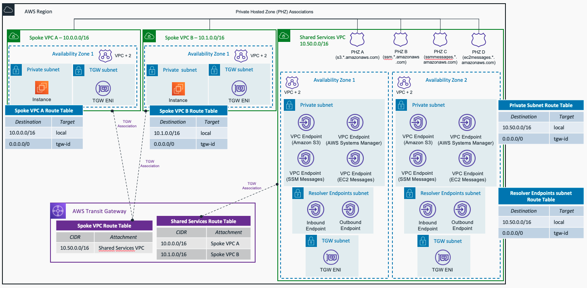

---

---

# AWS Hub and Spoke Architecture with Shared Services VPC - Terraform Sample

This repository contains terraform code to deploy a sample AWS Hub and Spoke architecture with Shared Services VPC, with the following centralized services:

- Managing EC2 instances using AWS Sytems Manager - ssm, ssmmessages and ec2messages VPC Endpoints.
- Amazon S3 access (the IAM role created for the EC2 instances allows READ ONLY access). If you want to change it, check the code in the *compute* module
- Hybrid DNS, both inbound and outbound Route 53 Resolver Endpoints are created.

The resources deployed and the architectural pattern they follow is purely for demonstration/testing purposes.

## Prerequisites

- An AWS account with an IAM user with the appropriate permissions
- Terraform installed

## Code Principles:

- Writing DRY (Do No Repeat Yourself) code using a modular design pattern

## Usage

- Clone the repository
- Edit the *variables.tf* file in the project root directory. This file contains the variables that are used to configure the VPCs to create, and Hybrid DNS configuration needed to work with your environment.
- To change the configuration about the Security Groups and VPC endpoints to create, edit the *locals.tf* file in the project root directory
- Initialize Terraform using `terraform init`
- Deploy the template using `terraform apply`

**Note** The default number of Availability Zones to use in the Spoke VPCs is 1. For the Shared Services VPC, the default (and minimum) number of AZs to use is 2 - due to configuration requirements for Route 53 Resolver Endpoints. To follow best practices, each resource - EC2 instance, VPC endpoints, and Route 53 Resolver Endpoints - will be created in each Availability Zone. **Keep this in mind** to avoid extra costs unless you are happy to deploy more resources and accept additional costs.

<!-- BEGIN_TF_DOCS -->
## Requirements

| Name | Version |
|------|---------|
|  [terraform](#requirement\_terraform) | ~> 1.1.2 |
|  [aws](#requirement\_aws) | ~> 3.71.0 |

## Modules

| Name | Source | Version |
|------|--------|---------|
|  [compute](#module\_compute) | ./modules/compute | n/a |
|  [hybrid\_dns](#module\_hybrid\_dns) | ./modules/hybrid_dns | n/a |
|  [iam\_kms](#module\_iam\_kms) | ./modules/iam_kms | n/a |
|  [phz](#module\_phz) | ./modules/phz | n/a |
|  [transit\_gateway](#module\_transit\_gateway) | ./modules/transit_gateway | n/a |
|  [vpc](#module\_vpc) | ./modules/vpc | n/a |
|  [vpc\_endpoints](#module\_vpc\_endpoints) | ./modules/vpc_endpoints | n/a |

## Inputs

| Name | Description | Type | Default | Required |
|------|-------------|------|---------|:--------:|
|  [aws\_region](#input\_aws\_region) | AWS Region to create the environment. | `string` | `"eu-west-1"` | yes |
|  [forwarding\_rules](#input\_forwarding\_rules) | Forwarding rules to on-premises DNS servers. | `map(any)` | <pre>{   "example-domain": {     "domain_name": "example.com",     "rule_type": "FORWARD",     "target_ip": [       "1.1.1.1",       "2.2.2.2"     ]   },   "test-domain": {     "domain_name": "test.es",     "rule_type": "FORWARD",     "target_ip": [       "1.1.1.1"     ]   } }</pre> | yes |
|  [on\_premises\_cidr](#input\_on\_premises\_cidr) | On-premises CIDR block. | `string` | `"192.168.0.0/16"` | yes |
|  [project\_identifier](#input\_project\_identifier) | Project Name, used as identifer when creating resources. | `string` | `"hub-spoke-shared_services"` | yes |
|  [vpcs](#input\_vpcs) | VPCs to create. | `map(any)` | <pre>{   "shared_services-vpc": {     "cidr_block": "10.50.0.0/16",     "flowlog_type": "ALL",     "number_azs": 2   },   "spoke-vpc-1": {     "cidr_block": "10.0.0.0/16",     "flowlog_type": "ALL",     "instance_type": "t2.micro",     "number_azs": 1   },   "spoke-vpc-2": {     "cidr_block": "10.1.0.0/16",     "flowlog_type": "ALL",     "instance_type": "t2.micro",     "number_azs": 1   } }</pre> | yes |

## Outputs

| Name | Description |
|------|-------------|
|  [instances\_created](#output\_instances\_created) | Instances created in each VPC |
|  [kms\_key](#output\_kms\_key) | KMS key ARN |
|  [private\_hosted\_zones](#output\_private\_hosted\_zones) | Private Hosted Zones |
|  [route53\_resolver\_endpoints](#output\_route53\_resolver\_endpoints) | Route 53 Resolver Endpoints |
|  [transit\_gateway](#output\_transit\_gateway) | Transit Gateway ID |
|  [vpc\_endpoints](#output\_vpc\_endpoints) | DNS name (regional) of the VPC endpoints created. |
|  [vpcs](#output\_vpcs) | List of VPCs created |
<!-- END_TF_DOCS -->

## Deployment

### Centralizing VPC Endpoints

- To centralize the SSM access for the instances created in the Spoke VPCs, 3 VPC endpoints are created with "Private DNS" option disabled: ssm, ssmmessages, and ec2messages. 3 Private Hosted Zones are created and associated with all the VPCs created (Spoke VPCs and Shared Services VPC) to allow DNS resolution.
- The fourth VPC endpoint created is to access Amazon S3. As indicated before, the EC2 instance roles only have *read* permission. 
- Amazon S3 interface endpoints **do not support** the private DNS feature, so to access S3 you will need to use endpoint-specific DNS names. The S3 VPC endpoint information provided in the outputs is the *Regional DNS name*. One example you can use to test the access to S3 is the following one: `aws s3 --region {aws_region} --endpoint-url https://bucket.{endpoint_dns_name} ls s3://`

### Hybrid DNS

Both Amazon Route 53 Inbound and Outbound Resolver Endpoints are created. The configuration applied in the *variables.tf* file is not valid (example values). To use the example with your real-environment, please change the following variables:

- **on_premises_cidr**: Indicate the CIDR block of your on-premises location to allow DNS traffic in the Inbound Endpoints. This value is added in the Security Group attached to that endpoint.
- **forwarding_rules**: Add correct values of the DNS domains and DNS servers (target IPs) in your on-premises location. This values are used by the Outbound Endpoints to forward DNS queries from AWS to your on-premises DNS servers.

------

## Target Architecture

### References

- AWS Reference Architecture - [Hybrid DNS Resolution with Amazon Route 53 Resolver Endpoints](https://d1.awsstatic.com/architecture-diagrams/ArchitectureDiagrams/hybrid-dns_route53-resolver-endpoint-ra.pdf)
- AWS Whitepaper - [Building a Scalable and Secure Multi-VPC AWS Network Infrastructure](https://docs.aws.amazon.com/whitepapers/latest/building-scalable-secure-multi-vpc-network-infrastructure/welcome.html)
- AWS Documentation - [AWS PrivateLink for Amazon S3 interface endpoints](https://docs.aws.amazon.com/AmazonS3/latest/userguide/privatelink-interface-endpoints.html#accessing-s3-interface-endpoints)

### Cleanup

Remember to clean up after your work is complete. You can do that by doing `terraform destroy`.

Note that this command will delete all the resources previously created by Terraform.

------

## Security

See [CONTRIBUTING](CONTRIBUTING.md) for more information.

------

## License

This library is licensed under the MIT-0 License. See the [LICENSE](LICENSE) file.